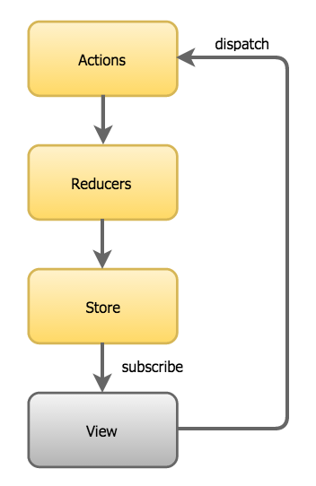

# Using a **Model** for State Management in Angular - Counter example

### Summarise the idea
We have a central service that receives messages. These messages can be sent from anywhere in the application: from components, other services, etc.
The service knows the initial state of the application, which is stored as a central object.
Each incoming message can trigger changes to this state. The service knows the appropriate instructions on how to handle the message and what changes to the state are triggered by it. 
If a new state is created, it is transmitted to all subscribers via an observable. Any interested instance in the application can therefore subscribe to the state changes.
The read flow and the write flow have been completely decoupled: The components receive the data via an observable and send messages to the service.
The service is the **single source of truth **and is the only part of the application that has the authority to send messages and stateto process changes.

### Redux follows three basic principles:
- Single Immutable State Tree
- Uni-directional data-flow
- Changes are made using pure functions (Reducers)

### Actions
These are Actions they can be originated by the User or the Server-side. They are the only source of information for the Store.

### Reducers
Reducers specify how the state changes in response to Actions. All Reducers must be pure functions meaning:
- they produce the same output given the same input
- they don’t produce side-effects (make calls to backend)

### Application Store
Redux uses a single store containing the Application State as a plain JavaScript object, in which the application state is stored as a single large nested data structure.

The Application Store is central to Redux  - the central component of the architecture and offers an API to:
- dispatch actions: **appStore.dispatch(action)**
- register listeners for change notification: **appStore.subscribe(callback)**
- read the Application State: **appStore.getState()**

# Angular CLI

This project was generated with [Angular CLI](https://github.com/angular/angular-cli) version 8.3.19.

## Development server

Run `ng serve` for a dev server. Navigate to `http://localhost:4200/`. The app will automatically reload if you change any of the source files.

## Code scaffolding

Run `ng generate component component-name` to generate a new component. You can also use `ng generate directive|pipe|service|class|guard|interface|enum|module`.

## Build

Run `ng build` to build the project. The build artifacts will be stored in the `dist/` directory. Use the `--prod` flag for a production build.

## Running unit tests

Run `ng test` to execute the unit tests via [Karma](https://karma-runner.github.io).

## Running end-to-end tests

Run `ng e2e` to execute the end-to-end tests via [Protractor](http://www.protractortest.org/).

## Further help

To get more help on the Angular CLI use `ng help` or go check out the [Angular CLI README](https://github.com/angular/angular-cli/blob/master/README.md).
